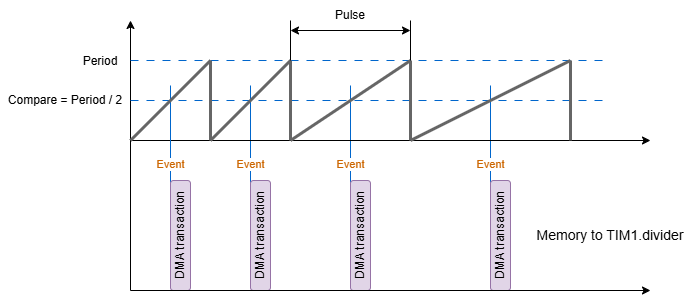
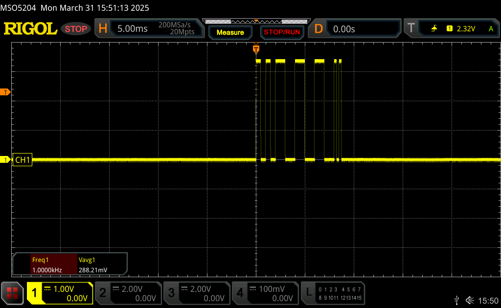
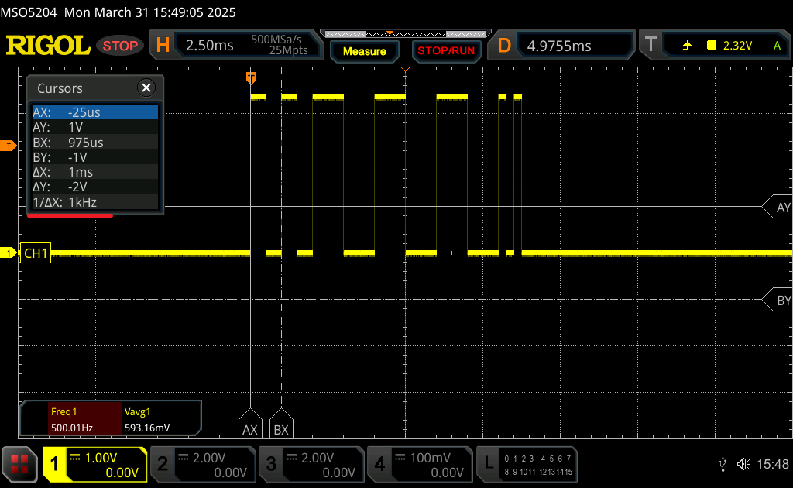
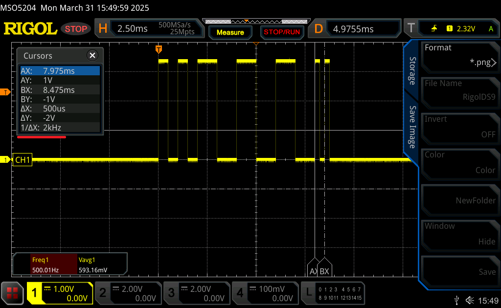
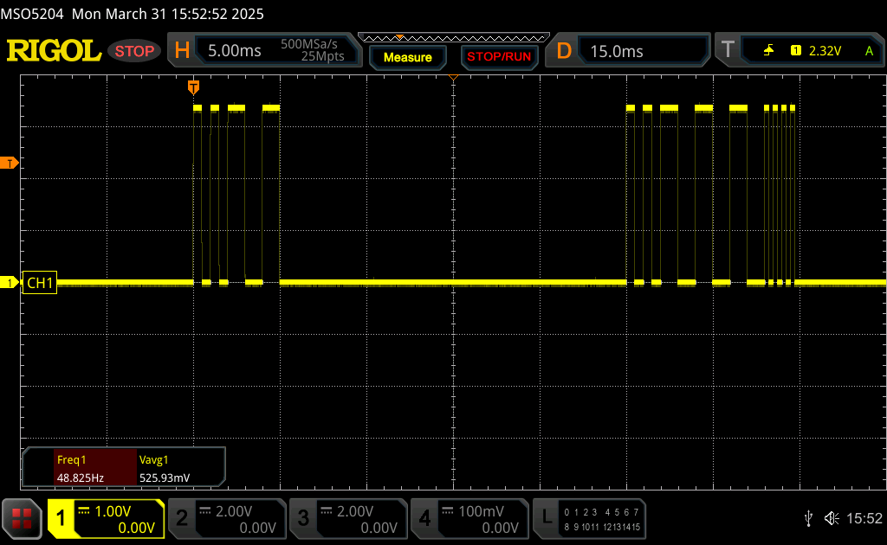
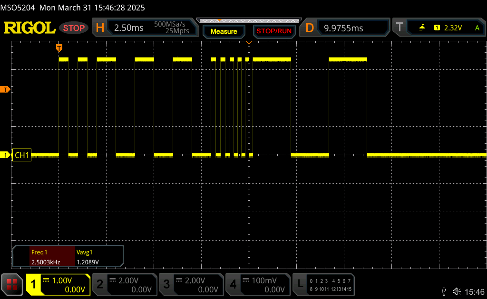

# Генератор сигналов для управления шаговым двигателем

Проект представляет собой аппаратный генератор сигналов для управления шаговым двигателем, реализованный на микроконтроллере **AT32F437ZMT7**.

## Функциональные возможности
- Запуск и остановка генерации сигналов
- Определение текущего состояния генерации
- Возврат максимального поддерживаемого размера сигнала
- Бесшовная генерация последовательностей импульсов разной частоты
- Полностью аппаратная генерация сигнала (без участия CPU) на выводе **PA8**

## Структура проекта
Код драйвера расположен в файлах:
- `Application/Include/generator.h`
- `Application/Source/generator.cpp`

## Принцип работы
Частота импульсов задаётся путём изменеия делителя таймера. Изменение делителя таймера происходит полностью аппартно, 
с помощью DMA. Так как изменение регистра делителя буфферизировано (фактическое изменнеие происходит при сообытии переполнения таймера), DMA
запускается по событию совпадения на канале сравнения которое равно половине периода таймера (скважность сигнала 50%). После переполнения таймер
начинает счёт с обновлённой частотой.



По окончании всех транзакций DMA, равных числу импульсов заданной последовательности сигнала, будет сгенерированно прерывание "Full data transfer 
interrupt", в котором включается прерывание таймера по событию переполнения. Как только последний импульс будет сгенерирован, счётчик останавливается.

Массив значений регистра делителя таймера рассчитывается в методе **add()**. Максимальная длина импульсов задана исходя из условий задачи.

## Примеры использования

### Пример 1
Для кода:
```cpp
std::array<Packet, 3> mySignal{{{2, 1000}, {3, 500}, {2, 2000}}};

Generator::init();
vTaskDelay(250U);
Generator::add(mySignal);
Generator::start();
```

Получаем осциллограмму (меандр с общим количеством импульсов 7 штук, где сперва идут 2 с частотой 1000 Гц, затем 3 с частотой 500 Гц и 2 с частотой 2000 Гц):







### Пример 2

Для кода:
```cpp
std::array<Packet, 3> mySignal{{{2, 1000}, {3, 500}, {2, 2000}}};

Generator::init();
vTaskDelay(250U);
Generator::add(mySignal);
Generator::start();
vTaskDelay(5U);
Generator::stop();
vTaskDelay(20U);
mySignal[2U].n = 4U;
Generator::add(mySignal);
Generator::start();
```
Получаем осциллограмму (через 5 мс остановка генерации импульсов, а еще через 20 мс начало новой последовательности):



### Пример 3
Для кода:
```cpp
std::array<Packet, 5> mySignal{{{2, 1000}, {3, 500}, {2, 2000}, {3, 2500}, {2, 250}}};

Generator::init();
vTaskDelay(250U);
Generator::add(mySignal);
Generator::start();
```

Получаем осциллограмму:


